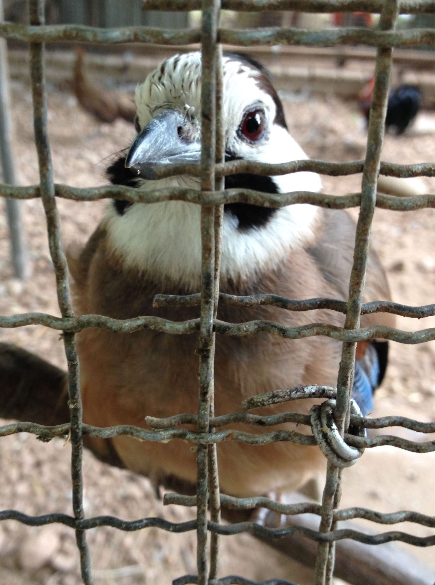
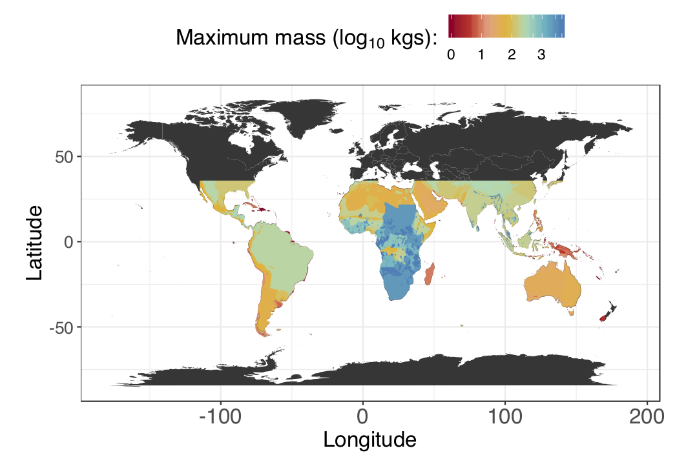
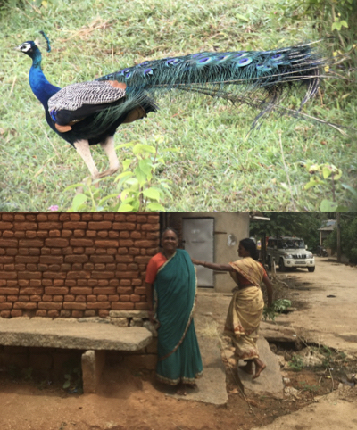
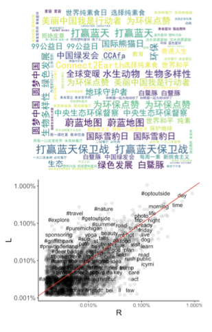

I combine mathematical theory and statistical analysis to examine problems in conservation science. 

 

## Conservation compliance

 

Currently, hunting, logging, and fishing threatens to drive thousands of species to extinction. Formal laws and informal social norms seek to regulate these activities and mitigate against their worst impacts. How do conservation practitioners and researchers assess what factors promote illegal activities that violate species or land protection laws? Interviews are one of the most common and cost-effective methods yet respondents may have strong incentives to answer dishonestly due to legal risks or social opprobrium. I have developed [open-source software](https://github.com/charlottehchang/zapstRR) to help conservation scientists analyze indirect survey data and I have applied these questioning techniques to quantify the prevalence and drivers of illicit bird hunting in Southwest China.

 
 

## Anticipating ecological outcomes from harvesting behaviors

 

Many terrestrial, developing-world hunting systems are characterized by data paucity and limited financial resources for monitoring and enforcement. Managers need to be able to anticipate threats to exploited wildlife, yet existing mathematical models tend to focus on data-intensive time series and/or population parameters. I have extended models from microeconomic [search theory](https://esajournals.onlinelibrary.wiley.com/doi/full/10.1002/eap.1796) to identify minimum thresholds for hunter prey selection. In another project, I am modeling how current hunting practices could reshape faunal assemblages using global datasets, literature synthesis, and mathematical theory.

 
 

## Biodiversity conservation in working lands

 

In much of South and Southeast Asia, farmlands are the dominant form of land use. Over the past twenty years, there has been increasing demand for tropical crops such as rubber (*Hevea brasiliensis*) and coffee (*Coffea spp.*). These tree crops have often displaced native lowland and montane forest. I have examined the responses of habitat specialists, such as forest birds and Endangered species, to different agro-ecological landscapes. Unfortunately, rubber farms in China have [limited conservation value](https://doi.org/10.1016/j.biocon.2017.04.026) but *robusta* coffee agroforests support a [surprisingly diverse assemblage of threatened birds](https://www.nature.com/articles/s41598-018-21401-1). Ongoing projects are investigating the socio-economic and ecological vulnerability of farmers and implications for voluntary land conservation.

 
 

## Conserving environmental common pool resources despite polarization

 

Solutions for global environmental crises demand consensus on difficult trade-offs and radical shifts in behavior. Yet social division and political polarization have stymied cooperation to achieve conservation goals. Moreover, prominent communication strategies have often back-fired and encouraged more entrenched views, because they have failed to account for polarized views on the environment. Additionally, research on the effects of polarization on environmental worldviews has largely neglected non-Western democracies. My work will offer key insights into how issues become polarized and quantify distinct environmental constituencies in the US and China, a contrasting pair of societies that can offer more general insight into how these dynamics play out globally. This project will use large social media datasets and mathematical theory to identify conservation constituencies and processes that can recover cooperation despite division.

 
 
 

### Press Coverage

My work has been covered by [Forbes](https://www.forbes.com/sites/grrlscientist/2018/02/17/arabica-versus-robusta-which-coffee-is-better-for-birds/#3341df276037), [Science Daily](https://www.sciencedaily.com/releases/2018/10/181005111439.htm), [Phys.org](https://phys.org/news/2018-10-bag-job-prey.html), the [Smithsonian Magazine](https://www.smithsonianmag.com/smart-news/coffee-farms-are-good-birds-other-wildlife-study-finds-180968205/), [India Today](https://www.indiatoday.in/pti-feed/story/robusta-plantations-offer-substantial-bio-diversity-benefits-study-1173304-2018-02-19), and the [New York Times](https://www.nytimes.com/2018/02/16/science/coffee-birds-biodiversity.html).
